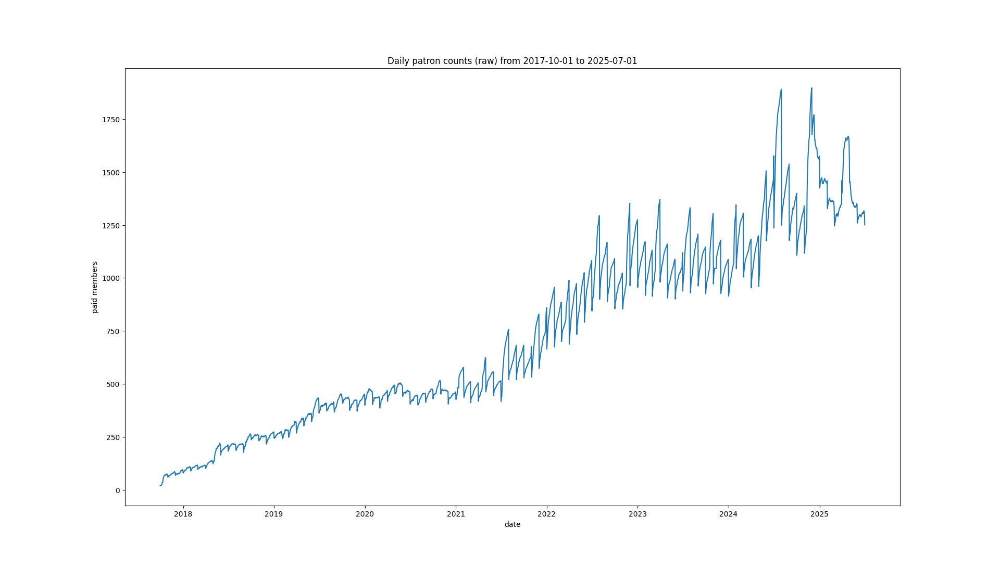
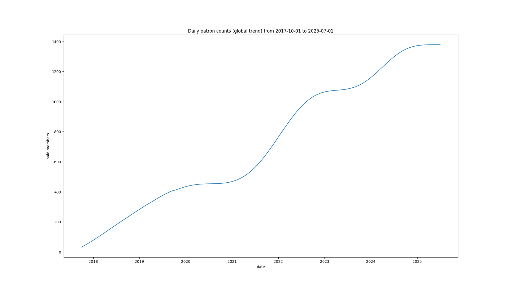
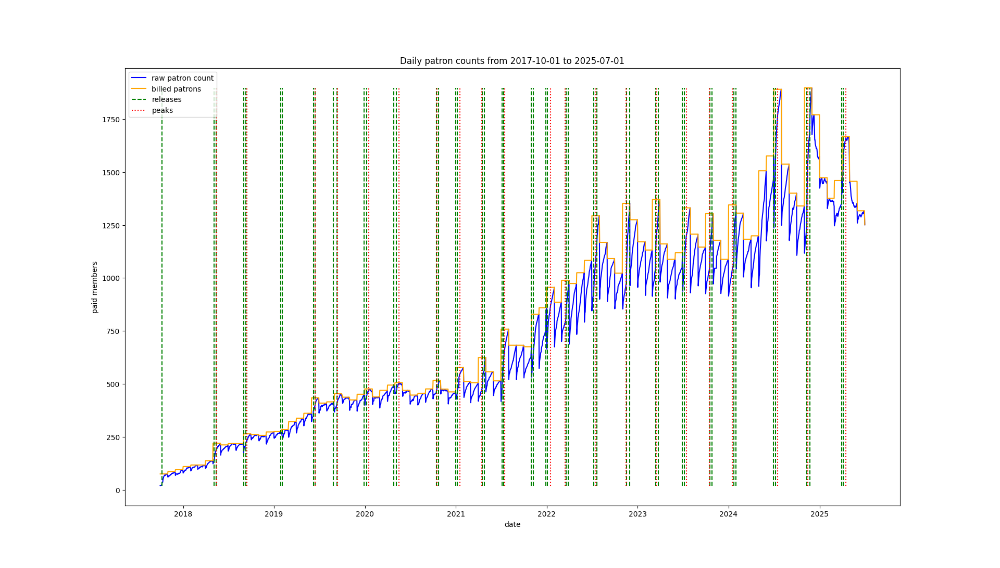
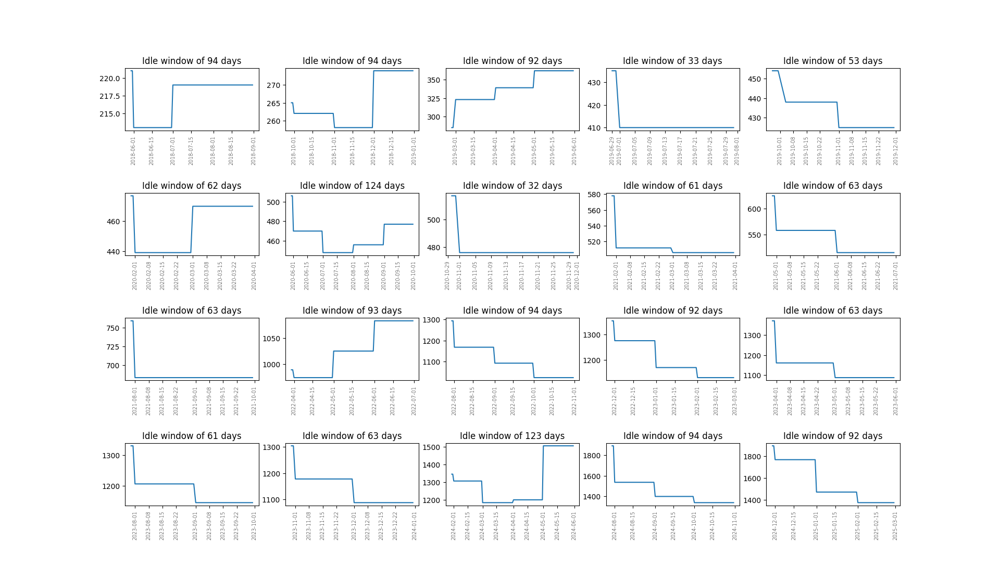

# Patreon-Data-Analysis

This is a WIP project aimed at collecting and analyzing patreon project growth rate with relation to the release frequency. The purpose of this project is purely educational.

Tested is the assumption that in a subscription based model, people tend to unsubscribe during prolonged inactivity times and then subscribe back to get access to the new release.

*Raw patron (subscriber) count*

A general trend can be derived by applying a simple low-pass filter, with a very low cut-off frequency. 

*Project growth over the years*

The patreon project under review uses the legacy [up-front billing system](https://support.patreon.com/hc/en-us/articles/8779192853261-Subscription-Billing-FAQ#h_01J446FNR0976JZJWG7EY3JFEY) - charged on subscription, then every 1st of the month. The monthly dips as explained by Patreon are the people who have unsubscribed the previous month being removed from the active patrons list. Knowing that, the active patron count can be boiled down to the maximum active patrons per month, since they are billed at least once upon subscribing.
The derived peaks in patron counts (makred with red dotted lines) coincide with the releases (marked with green dashed lines).

*Project update releases visualized against peaks in patron counts*

One could get a closer look specifically at the idle months between the releases. For a period to be considered idle in this case, it needs to span at least one month.

*Patron counts over idle months*

Release months' stats, including churn and growth rates:
[See full table](tables/release_t.md)

Inter-release months' stats, including average churn and growth rates:
[See full table](tables/inter_release_t.md)
